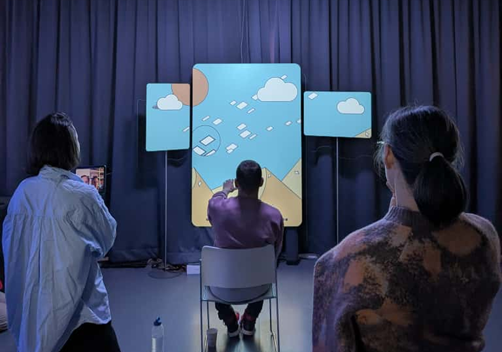

# Oracle of Suits

A project to design embodied, playful, and accessible interactive experiences revealing the stories behind playing-card suits for the Swiss Museum of Games.

## Summary

- [Code](/code)
- [Documentation](/documentation)
- [Press-kit](/press-kit)

## Live demo

_Note that the project was designed to be projected onto 3 separate screens._

- [Anachrony](https://lab.tekh.studio/anachrony/)

