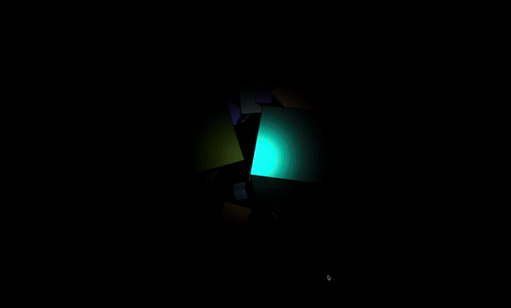

# FPS Control

## Objective

Explored lighting and materials in p5.js, and implemented camera controls via mouse and keyboard (no gesture input).

## Result

## Improvements

- Replace mouse control with head control
