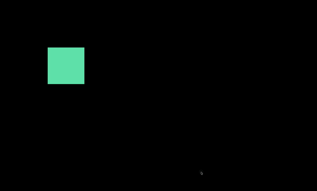

# Pixel Disintegration

## Objective

Explored pixel manipulation techniques in p5.js, creating a disintegration effect based on user interactions (mouse).

## Result

## Improvements

- Replace mouse control with hand control
