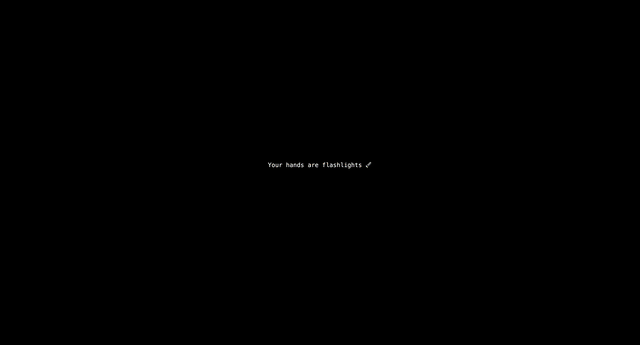

# Chronoscope Lamp

## Objective

Explore how wrist rotations can be used as a dimmer, and the palm of the hand as a "light" to reveal something hidden.

## Result

## Improvements

- Control the time with the "dimmer"
