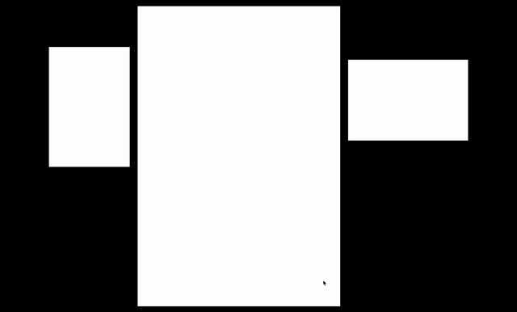

# Anachrony

## Technical

The project needs `Node 22` and `Yarn 1.22` to works.

### Development

The projet using p5.js with typescript and vite.js.

```bash
    yarn install # Install dependencies
    yarn dev # Start development server
    yarn build # Build for production
    yarn preview # Preview the production build
```

### Deployment

The project is automatically deployed to [lab.tekh.studio/anachrony/](https://lab.tekh.studio/anachrony/) when the code is pushed to the main branch.

## Shortcuts

### Debugging

```text
    'SHIFT + F' - Draw face landmarks
    'SHIFT + P' - Draw pose landmarks
    'SHIFT + H' - Draw hand landmarks
    'SHIFT + V' - Draw video feed

```

### Scene management

In each scene, use the numbers (1, 2, 3, 4...) to change the variations.

```text
    's' - Switch to Standby scene
    'i' - Switch to Intro scene
    'e' - Switch to Medieval Europe scene
    'm' - Switch to Mamluk scene
    'j' - Switch to Japan Edo scene
    'a' - Switch to Ancient China scene
    'f' - Switch to Final scene
```

---

## Preview



---

## Roadmap

> _Backlog items sorted by priority_

- Write the facts about cards for MMK and Intro sequences
- Define how to show gestures to the user (hidden things in interface)
- Implement the Planet animation for intro
- Record video presentation

### Nice to have

- Prototype the "Joker" sequence
- Prototype the "Edo "Japan" sequence
- Implement the Joker sequence
- Implement the "Medieval Europe" sequence
- Implement the "Ancient China" sequence
- Implement the "Edo Japan" sequence
- Compose sound design

### Done

- ~~Choose card for MMK sequences~~
- ~~Implement the Cardodex (left and right screens)~~
- ~~Implement the loader for traveling~~
- ~~Implement the Magnifier for intro~~
- ~~Reduce the camera area~~
- ~~Improve gesture detection for button~~
- ~~Define sound design approach~~
- ~~Write PDF documentation~~
- ~~Document installation process~~
- ~~Map gesture with possible actions (for each sequence)~~
- ~~Update "Research" section to reflect actual project~~
- ~~Refine global storyboard~~
- ~~Make the installation autonomous~~
- ~~Show the player that they must capture 4 cards per world~~
- ~~Introduce the joker earlier in the story~~
- ~~Build a basic scene engine with P5~~
- ~~Write a first draft of the storyboard~~
- ~~Define the tech-stack~~
- ~~Define an "Initial State"~~
- ~~Draw a sketch for each sequence~~
- ~~Reduce the number of gestures~~
- ~~Decide whether to use a template object~~
- ~~Define how information reaches the player~~
- ~~Install the wooden panels~~
- ~~Slicing screens with p5.js~~
- ~~Animating an input element on the screens~~
- ~~Prototype the "Mamluk World" sequence~~
- ~~Test the prototype with real people~~
- ~~Define a visual identity~~
- ~~Typographic research (1 / scene)~~
- ~~Display card information for a longer period~~
