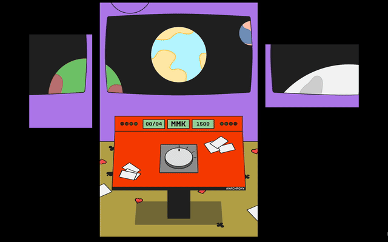

# Anachrony

Anachrony is a contemplative interactive game where you travel through different eras to return misplaced playing cards to their rightful time.

## Preview



## Streaming

The project use [Syphoner](https://www.sigmasix.ch/syphoner/) image to MadMapper.

## Technical

The project needs `Node 22.16.0` and `Yarn 1.22.22` to works.

### Development

The projet using `p5.js` with `typescript` and `vite.js`.

```bash
    yarn install # Install dependencies
    yarn dev # Start development server
    yarn build # Build for production
    yarn preview # Preview the production build
```

#### Images

The images must be exported at x4 (to maintain good quality with the magnifier effect).

### Deployment

The project could be deployed to [lab.tekh.studio/anachrony/](https://lab.tekh.studio/anachrony/) with github action.

## Shortcuts

Some useful shortcuts when the game is running.

### Debugging

```text
    'SHIFT + F' - Draw face landmarks
    'SHIFT + P' - Draw pose landmarks
    'SHIFT + H' - Draw hand landmarks
    'SHIFT + V' - Draw video feed

```

### Scene management

In each scene, use the numbers (1, 2, 3, 4...) to change the variations.

```text
    's' - Switch to Standby scene
    'i' - Switch to Intro scene
    'e' - Switch to Medieval Europe scene
    'm' - Switch to Mamluk scene
    'j' - Switch to Japan Edo scene
    'a' - Switch to Ancient China scene
    'f' - Switch to Final scene
```

## Roadmap

> _Backlog items sorted by priority_

- Prototype the "Joker" sequence
- Prototype the "Edo "Japan" sequence
- Implement the Joker sequence
- Implement the "Medieval Europe" sequence
- Implement the "Ancient China" sequence
- Implement the "Edo Japan" sequence
- Compose sound design

## Research


