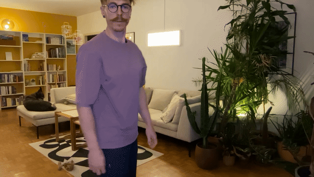

# The Chronoscope

Left arm extended, fingers pointing forward.
Rotating the elbow and shoulder adjusts the position of the time cursor.

## Implementation

- Think about level crossings with thresholds. Take the example of rotating the iPhone screen. The thresholds are different in both directions (Discussed with Pierre Rossel @ 2025-10-27)

## Prototypes

_Not prototyped yet._
