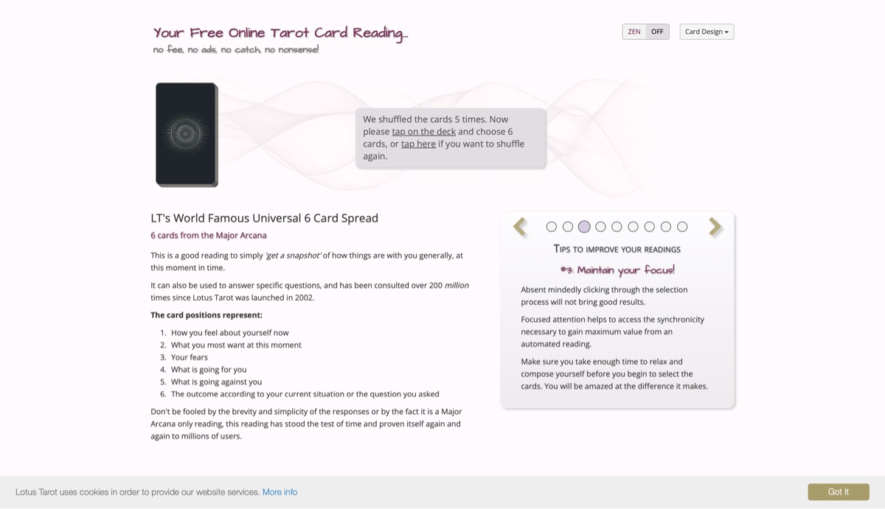
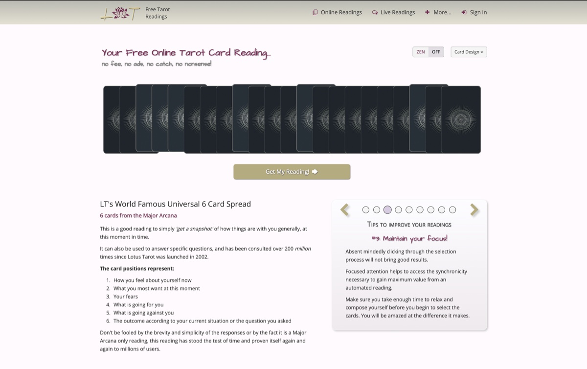
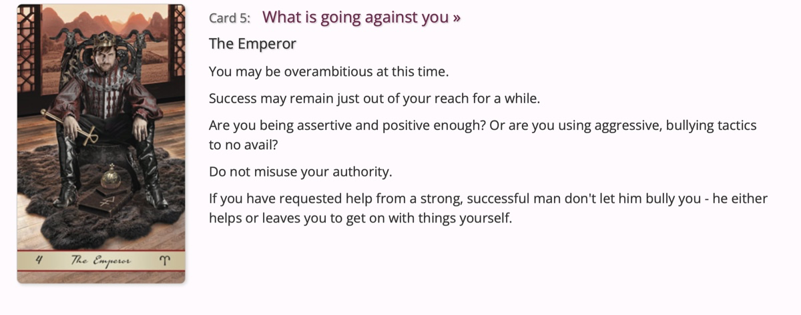
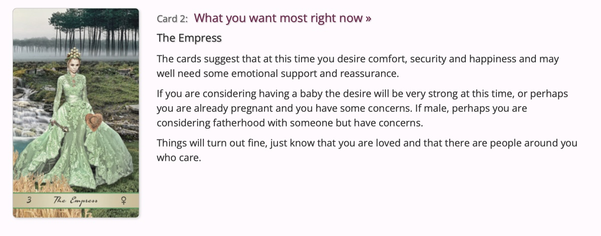
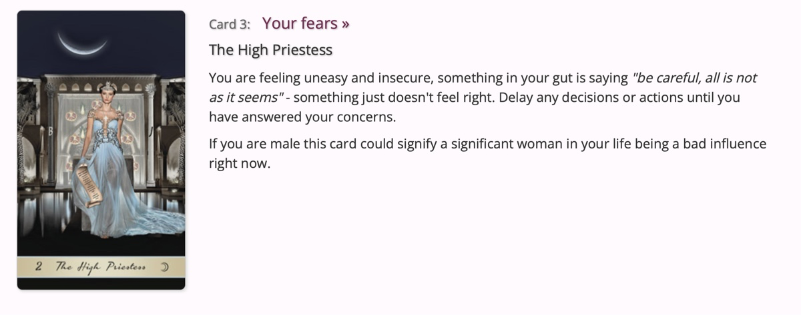
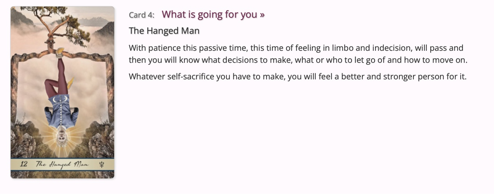
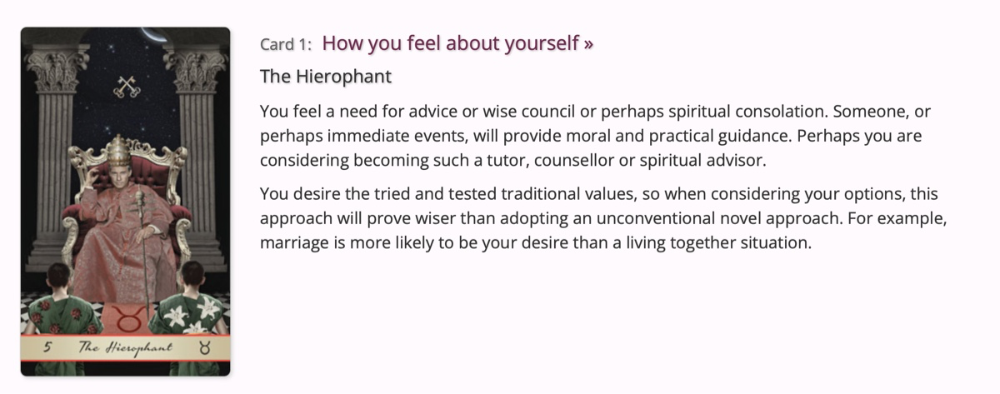

# Free Tarot Reading

## Journal

I’ve never actually _played_ tarot, and I don’t really know what a _reading_ is.

I have to choose 6 cards face down. Then, I’m given my _reading_.
I’m excited to find out my future.

I’m surprised at how receptive I am to the messages — not for _what_ they say, but for the way I can interpret them.

In a way, I’m trying to validate whether the predictions make sense. I question them, and position myself either for or against. It allows me to step a bit outside of myself — to take some distance.

Does this relate to me? If yes, what form does it take? How does it manifest in my daily life? How can I amplify it? How can I avoid it?
Is that what an oracle is for? To make you reflect on yourself? #prediction

Overall, these predictions are very _general_, vague. I think they’re meant to resonate with everyone.

## Source

- [Free Tarot Reading](https://www.free-tarot-reading.net/free)
