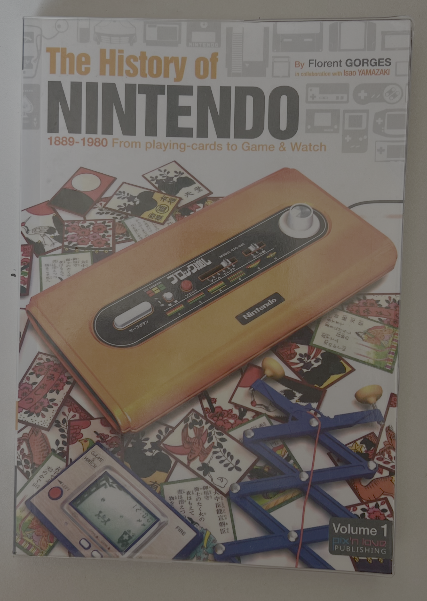
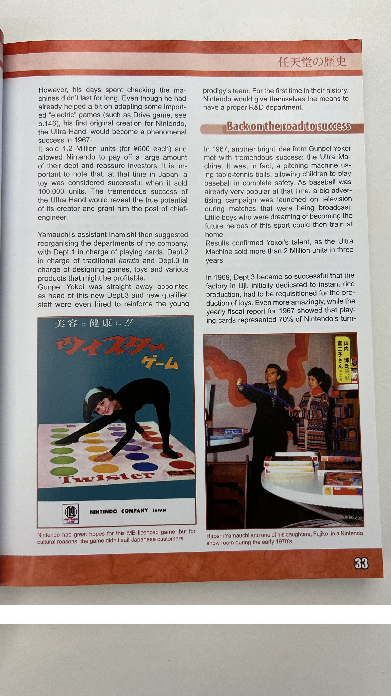
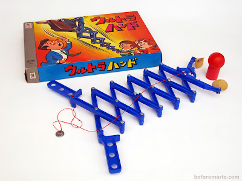

# The History Of Nintendo

## Journal

While going through the book, I came across an image of **Twister**, which didn’t catch on in Japan for cultural reasons. #twister

I also found a photo of **Hiroshi Yamauchi** using the **Ultra Hand**, one of the non-electronic toys Nintendo produced before entering the video game industry. #nintendo #toy

Can Twister be considered a _card game_?

[The Ultra Hand](http://blog.beforemario.com/2011/03/nintendo-ultra-hand-1966.html)
