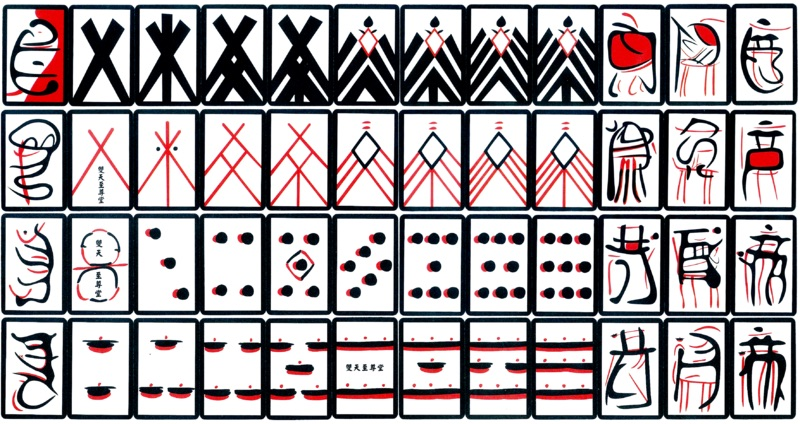

# Hanafuda Hand Painting

To deceive inspectors, some Japanese cards were hand-painted with changing patterns each month, making them difficult for authorities to recognize. Hanafuda cards were born from a ban on foreign games. The most refined version of this workaround is Hanafuda (花札, "flower cards"): 12 months represented by different flowers, without familiar numbers or suits.

## Sources

[Hanafuda: Japanese “Flower Cards” Designed to Circumvent Ban on Western Decks](https://99percentinvisible.org/article/flower-cards-japanese-hanafuda-designed-to-circumvent-ban-on-western-decks)
