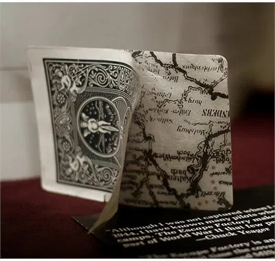

# Map Within Card

During WWII, special "map decks" hid secret escape routes inside their layers prisoners could soak the cards in water to reveal maps and find their way to freedom! #map

## Description

During World War II, an unlikely partnership was formed between American and British intelligence agencies and the United States Playing Card Company. Looking for deceptive ways to rescue allied prisoners of war from German camps, they turned to the playing card giant for help developing a special "Map Deck".

Bicycle Map Deck used in World War II to help save allied prisoners of war These amazing playing cards hid top-secret escape routes within their paper layers. By soaking the cards in water and peeling apart these layers, American and British prisoners could uncover special maps highlighting the best path to safety.

## Sources

[Fun Facts About Playing Cards](https://www.vanishingincmagic.com/playing-cards/articles/fun-facts-about-playing-cards/)
