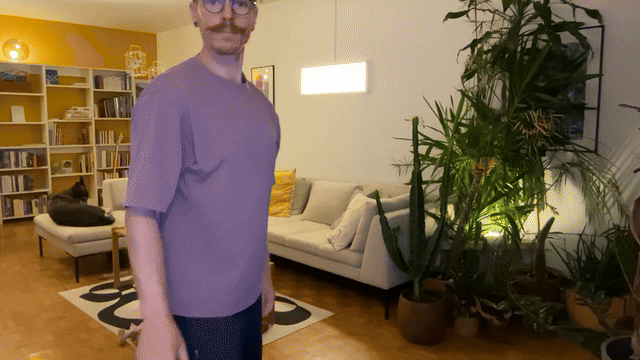
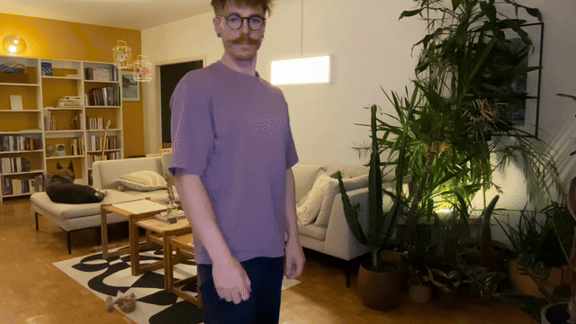

# Bestiary of Suits

## Pitch

Bestiary of Suits is an interactive installation where a player repairs a mythological breakdown by exploring different eras to recover misplaced fragments. Using temporal instruments mastered through gesture, the player restores the scattered patterns and colors of playing cards – until discovering that the chaos was caused by the Joker, caught in an identity crisis and trying to resemble the others.

### Keyword

`Anachrony`

### Novel combinaison

- Entry point: `Anachrony`
- Interaction: `Explore`
- Feedback: `Repair`

---

## Gestures

### The Move

Body position in space. Move forward, backward, left, or right.
The player can walk within a defined area.

_Not prototyped yet._

### The Chronoscope

Left arm extended, fingers pointing forward.
Rotating the elbow and shoulder adjusts the position of the time cursor.

_Not prototyped yet._

### The Flashlight

Right arm extended, fingers pointing forward.
The distance between the fingers controls the width of the light beam.

_Prototyped in [Chronoscope Lamp](../../../code/2025-10-24/chronoscope-lamp/) project._

### The Candle

Right arm extended, thumb raised.
The candle can be moved freely in three-dimensional space.
Quick movements dim the flame.

_Not prototyped yet._

### The Bellows

Body slightly leaning forward, lips tightened.
The player blows air in a chosen direction.

_Prototyped in [Look And Blow](../../../code/2025-10-23/look-and-blow/) project._

### The Palette

Index finger and thumb pinched together – the player moves an invisible “brush” in three-dimensional space.
They can change color by touching the fingers of the left hand with the pinched gesture.

_Prototyped in [Icon Painter](../../../code/2025-10-22/icon-painter/) project._

### The Filter

Both index fingers meet, then separate, revealing a translucent filter between the hands.
The player can move this filter through space.

_Prototyped in [Camera Reframe](../../../code/2025-10-21/camera-reframe/) project._

### The Configurator

Using the right hand, the player selects parts of their face (eyes, mouth, nose) to modify them.
Each feature acts like a button.

_Prototyped in [Body Interface](../../../code/2025-10-23/body-interface/) project._

---

## Storyboard

### **The Mythological Breakdown [Prologue]**

**Image**
A dark room. Brief flashes of light reveal that something is hidden, waiting to be illuminated. Shards of broken cards float in the air like frozen fireflies. The cards are blank – they’ve lost their visual identity. Some symbols drift freely without cards – a heart, a spade, a diamond, a club.

**Son**
A low hum, a discontinuous breath — the sound of chaos.

**Interaction**
By moving the [flashlight](./bestiary-of-suits.md#the-flashlight), with right hand, the player discovers they can reveal hidden fragments scattered around the room. The player shines light across the space, trying to understand what has happened. Some fragments are not quite like the others.

Once all different fragments are found, the player notices a [map within a card](../../observations/2025-10-13-map-within-card.md). This card reveals how to use the [Chronoscope](./bestiary-of-suits.md#le-chronoscope). The player learns a new gesture that allows them to travel across eras. By rotating the left hand, the scenery subtly shifts - time itself moves, following the rotation of the player’s wrist.

**Objective**
**Find five colored fragments** by illuminating them, and learn how to travel between eras.

### Chine Ancienne [Séquence 1]

**Idées**
Chine - Bougie - Ombre chinoise - utiliser sa main pour faire ombre chinoise ?

**Image**
Un espace d’encre et de papier.
Des traits flottent, incomplets, comme suspendus dans un brouillard.

Symbole au mauvais endroit ? Quel symbole ? Pourquoi ?

**Son**
...

**Interactions**
Le joueur fouille la pièce...
[Bougie](./bestiary-of-suits.md#the-candle)

**Objectif**
...

### Europe médiévale [Séquence 2]

**Idées**
...

**Image**
Un espace de cendre et de poussière, silencieux.
Des silhouettes de rois et de reines effacées.

Les visages reviennent, mais certains éléments semblent faux : une **moustache étrangère** sur un roi.

**Son**
...

**Interactions**
Le joueur souffle (mouvement de main avant/arrière).
Les cendres se dispersent, révélant les figures brûlées.
[Soufflet](./bestiary-of-suits.md#the-bellows)

**Objectif**
...

### Japon [Séquence 3]

**Idées**
...

**Image**
Une scène calme, baignée de brume et de fleurs Hanafuda délavées.

Les visages reviennent, mais certains éléments semblent faux : une **moustache étrangère** sur un roi.

Symbole au mauvais endroit ? Quel symbole ? Pourquoi ?

**Son**
...

**Interactions**
Le joueur utilise une **palette gestuelle** (mouvement de main pour repeindre).
En recolorant, il découvre un **rouge anormal**, venu d’ailleurs — preuve du vol du Joker.
[Palette](./bestiary-of-suits.md#the-palette)

**Objectif**
...

### Monde Mamelouk [Séquence 4]

**Idées**
...

**Image**
Un désert doré, saturé de soleil.
Les cartes sont devenues invisibles, brûlées par la lumière.

Un symbole (un grelot, peut-être) apparaît au mauvais endroit

**Son**
...

**Interactions**
Le joueur découvre un **filtre solaire** qu’il utilise pour ...
[Filter](./bestiary-of-suits.md#the-filter)

**Objectif**
...

### Autres séquences possibles

Église / interdiction : Feu, cendres, murmures (italie)
Cartes à collectionner : Paquets de bonbons, baseball, Pokémon
Futur des cartes : Écran tactile, IA, cartes qui “te regardent”

### La Révélation Du Joker [Séquence 5]

**Idées**
...

**Image**
Le Joker apparaît, patchwork de toutes les cartes : moitié roi, moitié fleur, moitié pixel.
Autour de lui, les cartes vibrent.>

> “I only wanted to belong. To be like the others.”

Le joueur comprend que c’est lui, **le voleur des fragments**.

**Son**
...

**Interactions**
Le joueur redonne au jocker son apparence normale, bien que multiple, en retirant les restes de fragments symboles sur son visage.
[Configurateur](./bestiary-of-suits.md#the-configurator)

**Objectif**
Réparer le mythe — ou le laisser ouvert.
Deux faisceaux apparaissent :

- lumière blanche (rétablir l’ordre),
- lumière multicolore (accepter le désordre).

### Réparation ou chaos [Épilogue]

**Si le joueur répare :**
Le monde se stabilise. Les cartes reprennent leur place. Le Joker disparaît dans la lumière.

**Si le joueur laisse libre :**
Les cartes se mettent à bouger, à rire. Le Joker allume la lampe et la tend au joueur.
Le jeu recommence.

**Image finale :**
Le mur des cartes brille. Une carte reste vide : celle du joueur ?

---

### Technique

- 1 ou 3 écrans (devant gauche, droite)
- Environnement 3D
- Zones au sol éclairées
- Son 5.1 (minimum)
- Représentation physique des cartes (figures ont disparues), mur ?

## Research

...

### Insights

...

### Sources

...
