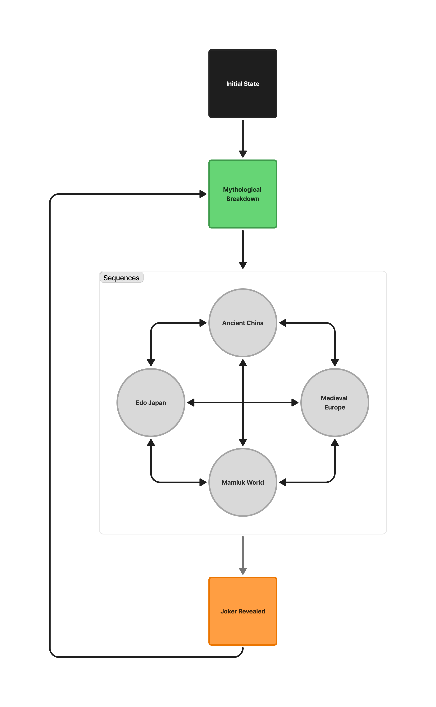
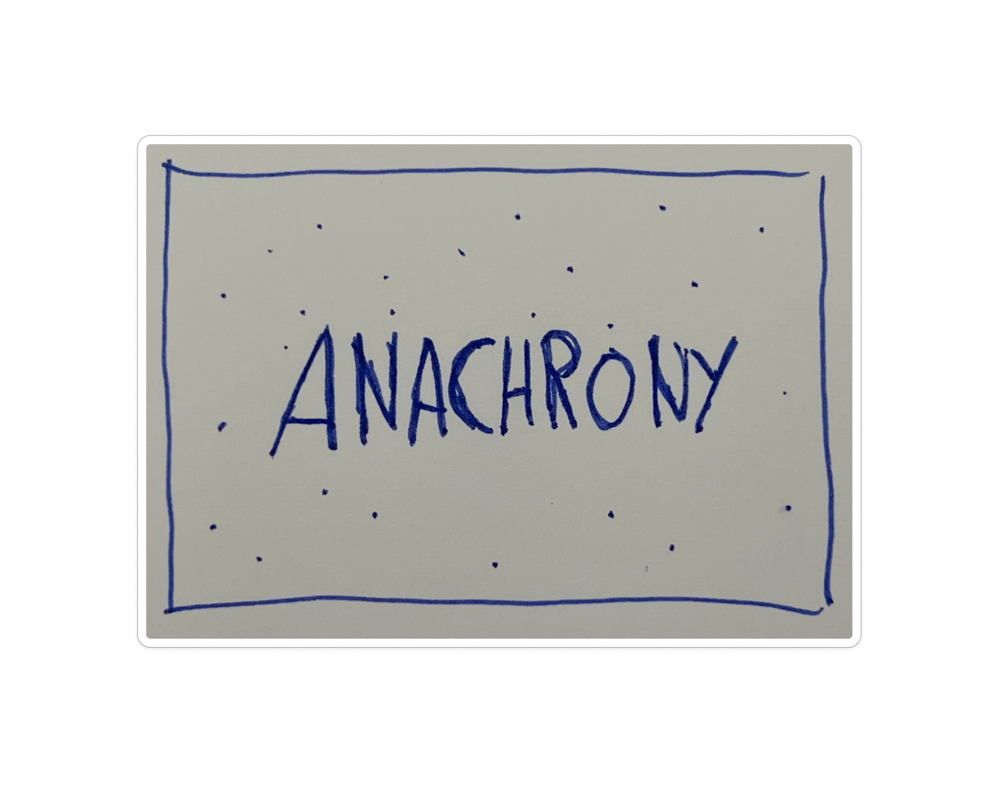
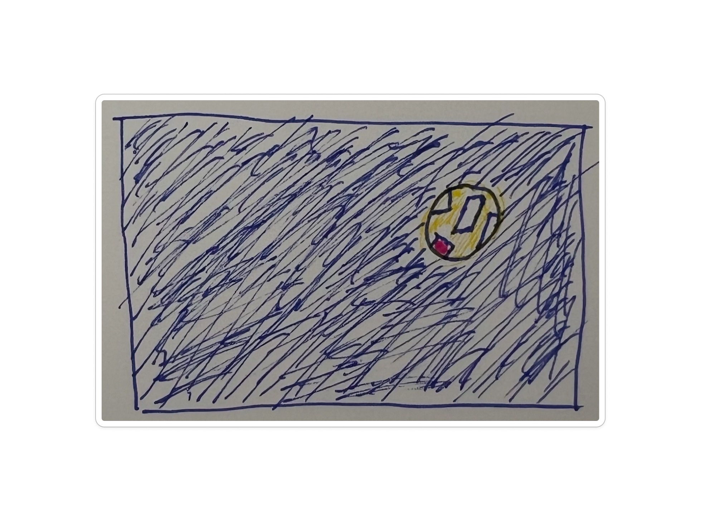
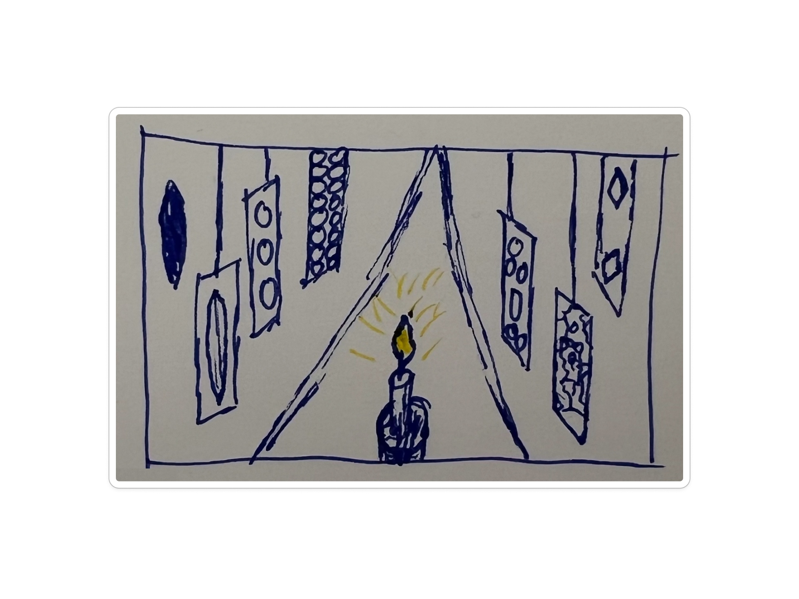
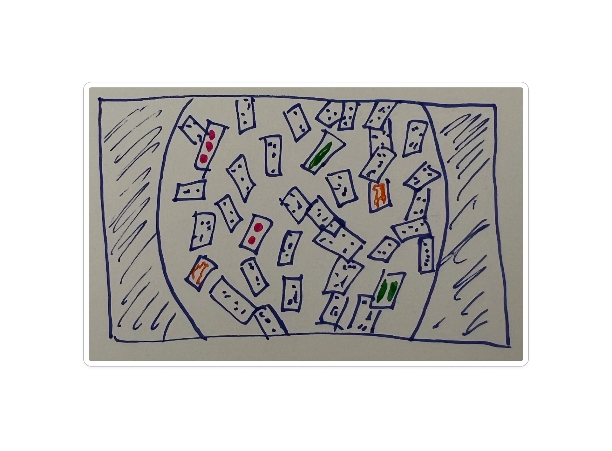
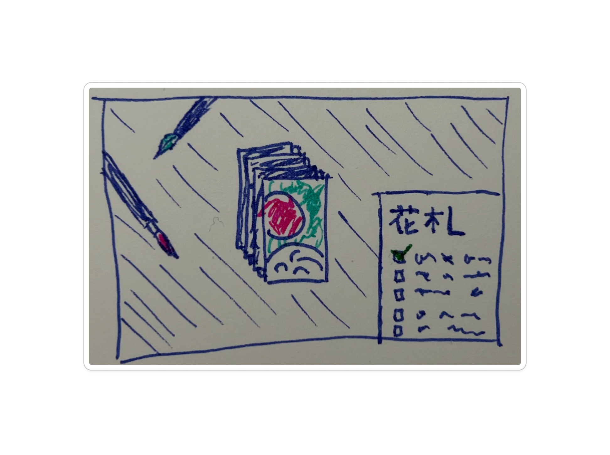
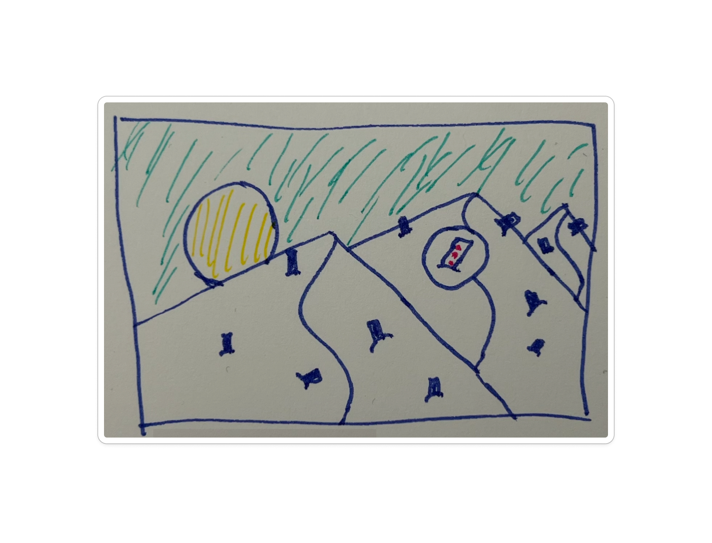
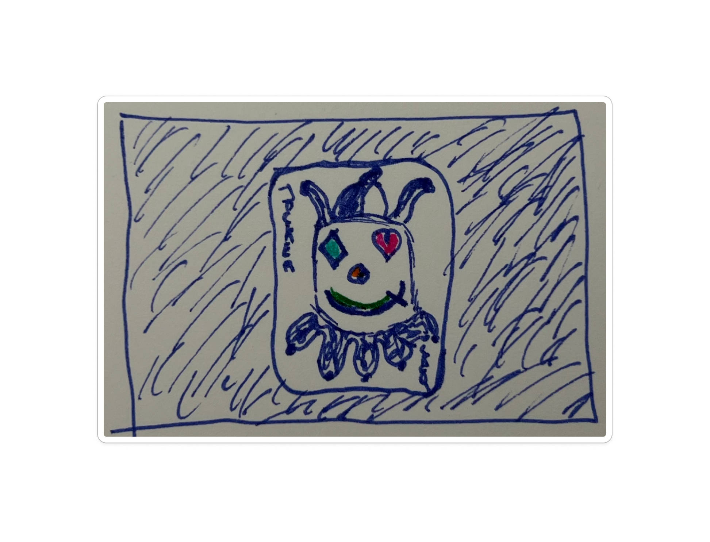

# Anachrony

`Anachrony` is a [gesture-based](../gestures/README.md) interactive game where players travel through different historical worlds to recover playing cards scattered across time. By simulating light, breath, painting, and a spyglass with body movements, they return the cards to their rightful eras. At the end, they confront the Joker, whose identity crisis has caused the cards to be lost in the wrong timelines.

## Core interaction

The player uses various gestures to interact with the environment.

| **Title**                                           | **Goal**                            | **Gesture**                                     | **Feedback**  |
| --------------------------------------------------- | ----------------------------------- | ----------------------------------------------- | ------------- |
| [The Chronoscope](../gestures/the-chronoscope.md)   | Navigating between eras             | Turn the left hand in line with the arm         | Light + Sound |
| [The Flashlight ](../gestures/the-flashlight.md)    | Reveal card fragments               | Move the right hand in line with the arm        | Light + Sound |
| [The Candle](../gestures/the-candle.md)             | Reveal the silhouettes of the suits | Thumbs up, move your hand in space              | Light + Sound |
| [The Bellow](../gestures/the-bellows.md)            | Removing dust from cards            | Blow gently, as if to clear dust                | Light + Sound |
| [The Palette](../gestures/the-palette.md)           | Reveal the colors of the suits      | Move your hands in a painting motion            | Light + Sound |
| [The Spyglass](../gestures/the-spyglass.md)         | See further in the scene            | Use both index fingers to zoom                  | Light + Sound |
| [The Configurator](../gestures/the-configurator.md) | Change the appearance of the joker  | Touching your eyes, nose and mouth like buttons | Light + Sound |

## Keyword

`Anachrony`

## Novel combinaison

- Entry point: `Anachrony`
- Interaction: `Reveal`
- Feedback: `Repair`

## Storyboard

### Initial State

_Initial state, installation in standby mode, waiting for a player._

#### Images

A black screen.
The project title appears in white capital letters: "ANACHRONY".
The title looks [fragmented](https://www.instagram.com/p/DH1AjFzi3c6/?hl=fr&img_index=1) — broken into several floating pieces, yet still readable.
The fragments move slowly, as if drifting through space.

#### Sound

TO BE DEFINED

#### Interactions

As the player approaches the screen, a sensor detects their presence and triggers the introduction sequence (Prologue).
The title fades out, the image zooms in, and the scene transitions smoothly to the next sequence.

#### Exit

The player approaches the screen, starting the experience.

### The Mythological Breakdown [Prologue]

_Triggers when the player is facing the screen._

####

#### Images

A dark room. Brief flashes of light reveal that something is hidden, waiting to be illuminated. Shards of broken cards float in the air like frozen fireflies. The cards are blank – they've lost their visual identity. Some symbols drift freely without cards – a heart, a spade, a diamond, a club.

#### Sound

A low hum, a discontinuous breath — the sound of chaos.

#### Interactions

By moving [the flashlight](../gestures/the-flashlight.md), with right hand, the player discovers they can reveal hidden fragments scattered around the room. The player shines light across the space, trying to understand what has happened. Some fragments are not quite like the others.

Once all different fragments are found, the player notices a [map within a card](../observations/2025-10-13-map-within-card.md). This card reveals how to use [the chronoscope](../gestures/the-chronoscope.md). The player learns a new gesture that allows them to travel across eras. By rotating the left hand, the scenery subtly shifts - time itself moves, following the rotation of the player's wrist.

Each time the player finds a "foreign" symbol, he learns where this symbol comes from, and in which era it will be replaced.

The player can freely move from one era to another. Navigation is non-linear.

#### Exit

Find five colored fragments by illuminating them, and learn how to travel between eras.

### Ancient China [Sequence 1]

_Non-linear navigation_

#### Images

The player is in a dark room, with pieces of paper hanging from the ceiling.
These pieces of paper are stencils used to draw the symbols on playing cards.
Some of these stencils seem foreign to Chinese culture.
By holding the candle close to the stencils, the player reveals the symbols through a play of (Chinese) shadows projected onto the wall.

#### Sound

TO BE DEFINED

#### Interactions

The player uses [the candle](../gestures/the-candle.md) to reveal the hidden symbols behind the stencils.
As the flame approaches, shadows form on the wall, uncovering the foreign symbols.

#### Exit

The player has revealed four foreign symbols.

### Medieval Europe [Sequence 2]

_Non-linear navigation_

#### Images

The player finds themselves in a candle-lit room, the flame flickering softly above a round stone table.
A thick layer of dust covers the surface.
When the player blows on it, the dust slowly drifts away, revealing card symbols carved into the stone.
Some of these symbols don’t belong to the medieval deck — foreign marks from other eras.
If the player blows too hard, the cards on the table shift and scatter in the draft.

#### Sound

TO BE DEFINED

#### Interactions

Using [the bellows](../gestures/the-bellows.md), the player blows onto the screen to remove the dust and uncover the cards lying on the table.

#### Exit

The player has uncovered 4 foreign symbols.

### Edo Japan [Sequence 3]

_Non-linear navigation_

#### Images

A wooden table in a ryokan (traditional Japanese accommodation). The cards are laid out on the table (isometric view).

#### Sound

TO BE DEFINED

#### Interactions

Some Hanafuda cards have lost their colors, while others have symbols from other card games. The player uses [the palette](../gestures/the-palette.md) to recolor the cards and erase the intruding symbols.

By painting the cards, the player learns that [some hanafuda cards were hand-painted](../observations/2025-10-13-hanadufa-hand-painting.md) to circumvent bans on foreign games.

#### Exit

Cleared 3 foreign symbols and recolored 3 cards.

### Mamluk World [Sequence 4]

_Non-linear navigation_

#### Images

A golden desert, saturated with sunlight.
Cards are planted in the sand like swords.
Some of them do not belong to the Mamluk deck.
The sun burns so brightly that it’s almost impossible to see the details on the cards.

#### Sounds

TO BE DEFINED

#### Interactions

The player uses the [spyglass](../gestures/the-spyglass.md) to look across the desert.
By slowly moving their hand, they scan the landscape through the spyglass revealing the foreign cards hidden in the sand.
Each discovery sharpens the image of the world, as if the act of seeing restored order.

#### Exit

The player found 5 foreign cards.

### The Joker Revealed [Final Sequence]

_Sequence unlocked once all others have been completed._

#### Images

A full-screen joker card appears. The card follows the player's head movements ([x,y axes](https://codepen.io/Web_Cifar/full/wvrzKxK)). Symbols belonging to other cards are visible on his face. They scroll rapidly, changing from one to another (like a slot machine).The player understands that he is the thief of the fragments.

> _I just wanted to be normal, like everyone else..._

The player must help the joker rediscover his identity by touching the symbols on his face.
Once the Joker's card is fully "restored", the screen darkens. A few flashes of light briefly reveal the Joker's card — until, in the final flash, it transforms into a card showing a pixelated representation of the player.

The Joker has stolen the player's identity.

#### Sound

TO BE DEFINED

#### Interactions

Using [the configurator](../gestures/the-configurator.md), the player can change the symbols on the Joker's face to restore his "normal", yet multiple, appearance.

Once the Joker's card is fully reconstructed, an image of the player appears in place of the Joker on the card.

The player must then [TO BE DEFINED] to reclaim their identity.
But to do so, they must break the card, freeing the Joker — and shattering the myth once again.

#### Exit

The myth is broken once more.
The player finds themselves back in the initial room, with the floating fragments — only now, the player's own card drifts among them.

### Possible additional sequences

- Church / Prohibition: Fire, ashes, whispers (Italy)
- Collectible Cards: Candy packs, baseball, Pokémon
- Future of Cards: Touchscreens, AI, cards that "watch you"

## Technical

### Tech-stack

#### Software

- 3D Environment: Three.js || React Three Fiber || P5.js (WebGL)
- Gesture Recognition: MediaPipe [Hands](https://ai.google.dev/edge/mediapipe/solutions/vision/hand_landmarker?hl=fr) && [Pose](https://ai.google.dev/edge/mediapipe/solutions/vision/pose_landmarker?hl=fr) && [Face](https://ai.google.dev/edge/mediapipe/solutions/vision/face_landmarker?hl=fr)
- Sound Design: TO BE DEFINED

#### Hardware

- Sound : TO BE DEFINED (5.1)
- Screen: TO BE DEFINED (1 or 3 screens)
- Camera: TO BE DEFINED (1 or 2 cameras)
- Lighting: TO BE DEFINED (ambient + spotlights)

## Research

My research began with the materiality of playing cards — their texture, manufacturing processes, and physical properties. This led me to study the objects and gestures of cheating, as a way to understand how material and manipulation intertwine.

From there, I explored the mirror ("shiner") as an interface — a poetic object that reveals what is usually invisible. The mirror later gave way to the story of Bianco's 19th-century scam, where cards became tools of deception and illusion.

When this narrative became too narrow, it coincided with the moment we formed groups and began merging ideas. The project quickly evolved into a collection of disparate mini-games, closer to WarioWare than to a cohesive narrative experience. This lack of depth led me to step back and rebuild the conceptual framework.

Drawing on Nicolas Nova's writings (La persistance du merveilleux, Bestiary of the Anthropocene), I reframed the project around myth as a possible common denominator — both as a way of telling stories and as a lens through which to view playing cards themselves. This shift led to the notion of a mythological breakdown, where the player explores the world through gesture-based exploration, restoring misplaced cultural and temporal fragments to their rightful eras.

### Insights

5 insights that inspired the current form of the concept.

1. From Mini-Games to Myth
   Moving away from WarioWare-style entertainment opened space for a slower, poetic, and symbolic experience.
   The project shifted from playing stories to unfolding myths.

2. Collection as Narrative Engine
   Inspired by Pokémon and the Pokédex, the project embraces collection as a way to tell stories through discovery, classification, and repair.
   This mechanic has been a central interest since the beginning of the workshops.

3. The Card as Cultural Mirror
   Each card reflects a society and a moment in time — a fragment of human culture that can be misplaced, reinvented, or rediscovered.
   This led to the idea of treating the history of cards as a mythological breakdown.

4. Exploration during the creative coding workshop
   The creative coding workshop was a turning point to test gestures as storytelling tools, transforming interaction into a poetic language.

5. Inventory as Storytelling
   The diversity of anecdotes, symbols, and aesthetics across eras inspired the idea of creating an inventory-based narrative: a form of storytelling through fragments, where each discovery contributes to repairing the myth.

### References

- 📘 [Persistance du merveilleux](https://www.premierparallele.fr/livre/persistance-du-merveilleux) – (2020)
- 📘 [Bestiaire de l'Anthropocène](https://artfiction.ch/produit/bestiaire-de-lanthropocene/) - (2021)
- 📰 [Trading Playing Cards and the Birth of Collecting](https://www.nationalgeographic.com/history/article/trading-playing-cards) - (2023)
- 📰 [Are the Face Cards (Kings, Queens, Jacks) Real People?](https://history.howstuffworks.com/history-vs-myth/kings-queens-and-jacks-playing-cards-real-people.htm) - (2024)
- 📺 [The Untold Secrets of Pokémon's Monster Mythology](https://www.pbs.org/video/the-untold-secrets-of-pokemons-monster-mythology-ha2xkp/) - (2023)
- 📺 [Florence (Gameplay Only)](https://www.youtube.com/watch?v=4Dxw4dj_AY8) - (2024)

## Roadmap

- ~~Write a first draft of the storyboard~~
- ~~Define the tech-stack~~
- ~~Define an "Initial State"~~
- ~~Draw a sketch for each sequence~~
- Reduce the number of gestures
- Decide whether to use a template object
- Define how to show gestures to the user
- Define how information reaches the player
- Prototype the "Mamluk World" sequence
- Test the prototype with real people
- Define a visual identity
- Define sound design approach
- Prototype "The Chronoscope" gesture
- Prototype "The Candle" gesture
- Prototype "The Palette" gesture (v2)
- Prototype the head movement tracking for the final sequence
- Create a prototype of "The Mythological Breakdown" sequence
- Update "Research" section to reflect actual project
