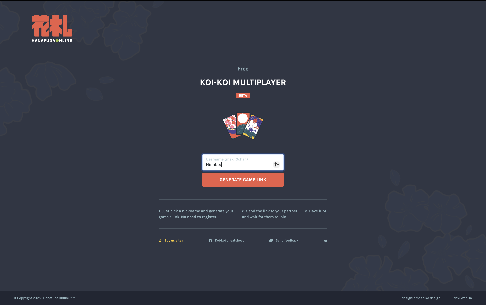
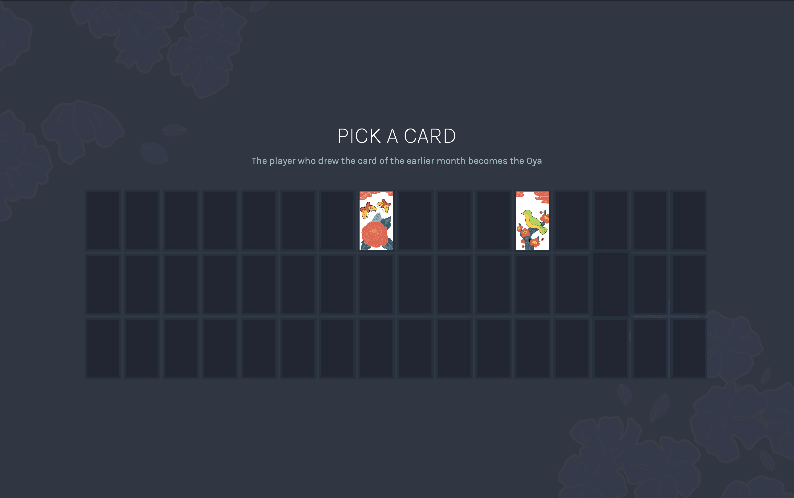
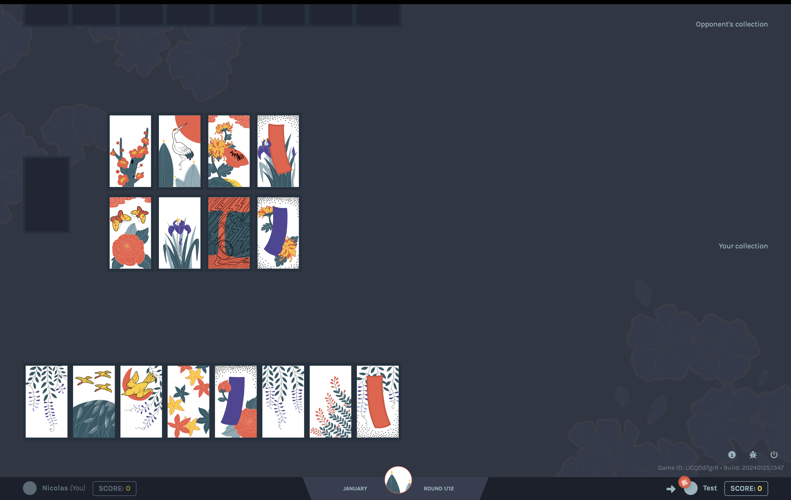

# Hanafuda

[https://www.hanafuda.online/game](https://www.hanafuda.online/game)

## Logs

Le jeu est prévu pour être multijoueur. Je suis seul, je triche en ouvrant un nouvel onglet en navigation privée. Je joue donc contre moi-même.

Je ne comprends pas du tout le jeu. C'est la première fois que je le vois. Je suis intéressé par ce jeu car il a un lien avec l'histoire de Nintendo - histoire qui m'intéresse.

Le jeu ne présente pas de onboarding. Je suis perdu. Je ne sais pas quoi faire. Difficile de comprendre les règles en jouant.

Je commence quand même une partie, mais je suis bloqué. Je pense qu'il y a un bug car plus rien ne fonctionne.

## FAQ

### Qu'est ce que le Hanafuda ?

Le Hanafuda (花札, « cartes à fleurs ») est une famille de jeux de cartes japonais utilisant 48 cartes, réparties en 12 séries de 4 cartes, chacune représentant un mois de l’année avec une fleur/plante associée (ex. : pin en janvier, cerisier en mars, érable en octobre, etc.). Un mélange entre chance et stratégie, comme tous les jeux de carte, en somme ?
