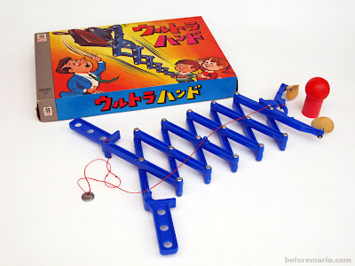

# The History Of Nintendo

## Logs

En parcourant l'ouvrage, je tombe sur image du Twister, qui n'a pas pris au japon pour des raisons culturelle. On voit aussi une image de Hiroshi Yamauchi en train d'utiliser un **The Ultra Hand.** un des jouets non éléctroniques que Nintendo a produit avant de se lancer dans le jeu vidéo.

Peut-ont considérer le Twister comme un jeu de carte ?

[The Ultra Hand](http://blog.beforemario.com/2011/03/nintendo-ultra-hand-1966.html)
