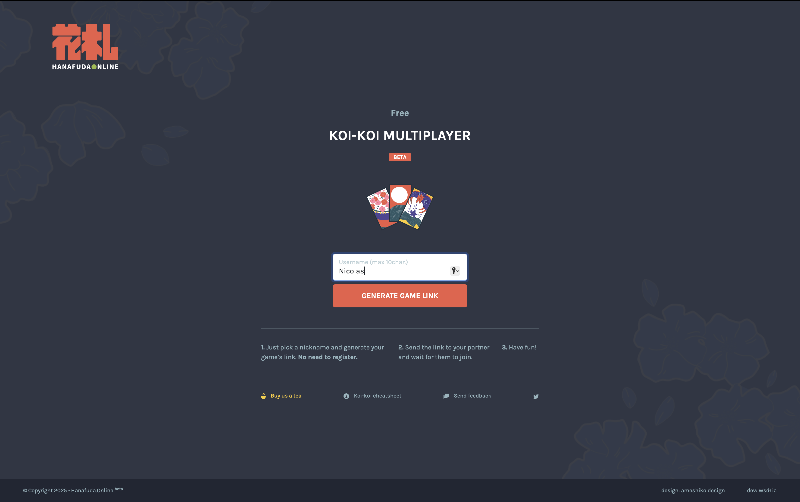
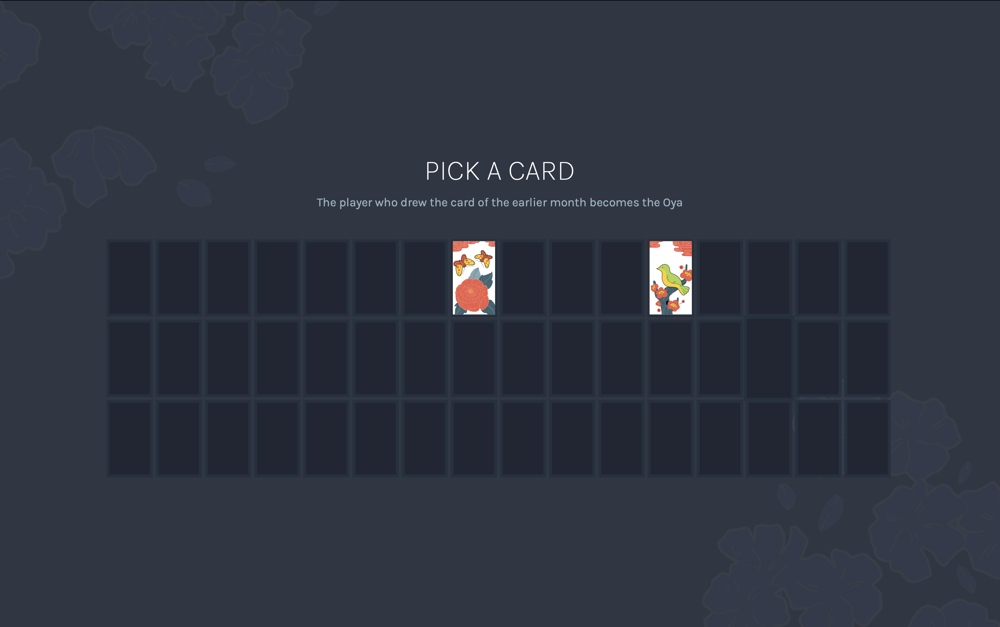
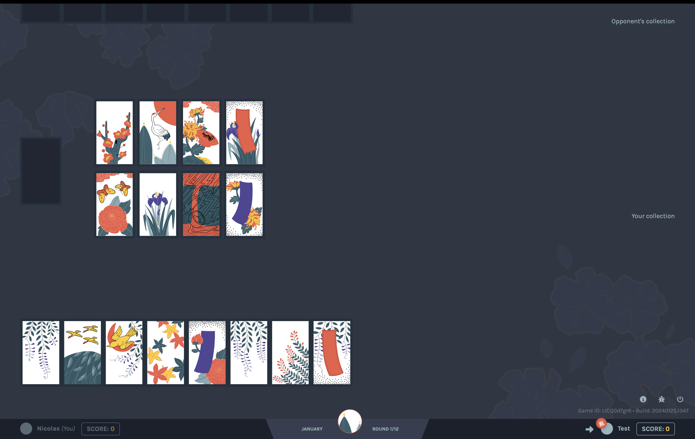

# Hanafuda

## Journal

The game is meant to be multiplayer. I’m alone, so I cheat by opening a new tab in incognito mode. I’m basically playing against myself. #cheating

I don’t understand the game at all. It’s the first time I’ve seen the [[process/references/hanafuda|hanafuda]] game. #hanafuda

I’m interested in this game because it’s connected to the history of Nintendo — a story that fascinates me. #nintendo

The game has no onboarding. I’m lost. I don’t know what to do. It’s hard to figure out the rules just by playing. #onboarding

I start a game anyway, but I get stuck. I think there’s a bug because nothing works anymore.

## Sources

- [https://www.hanafuda.online/game](https://www.hanafuda.online/game)
