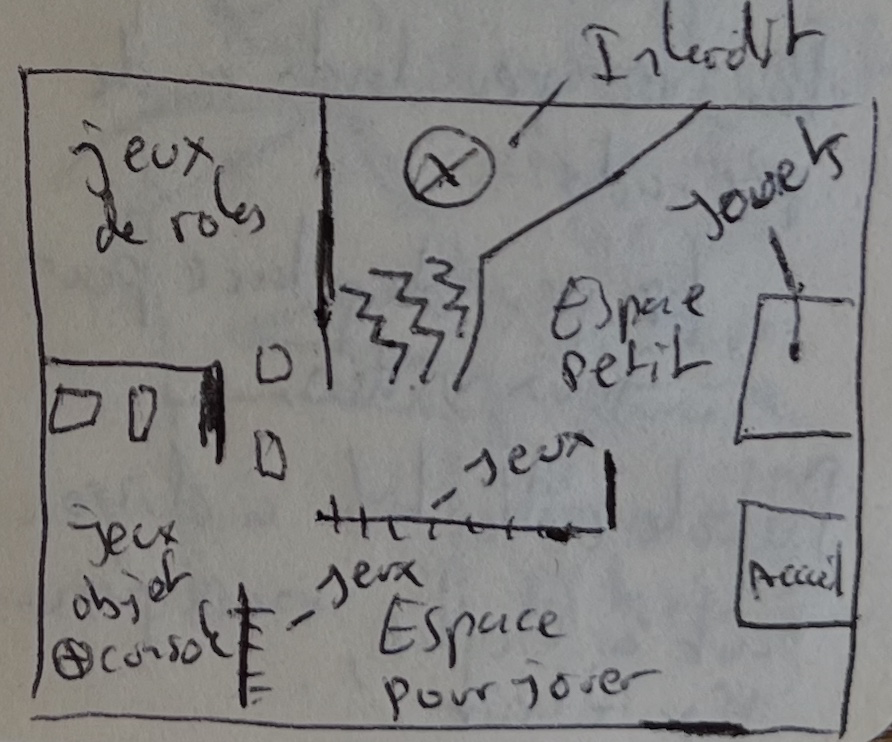
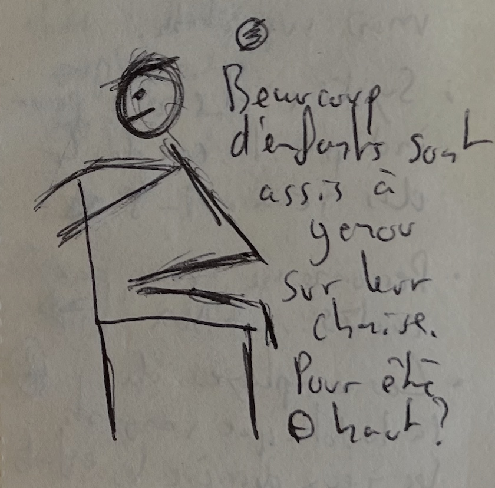
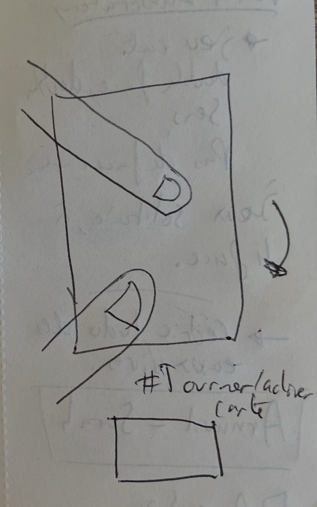
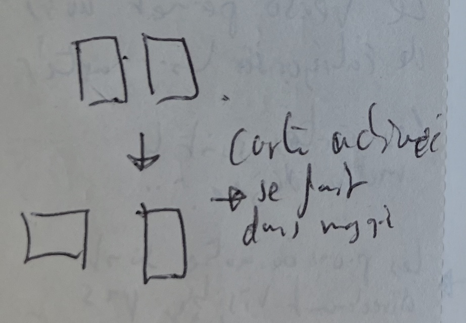
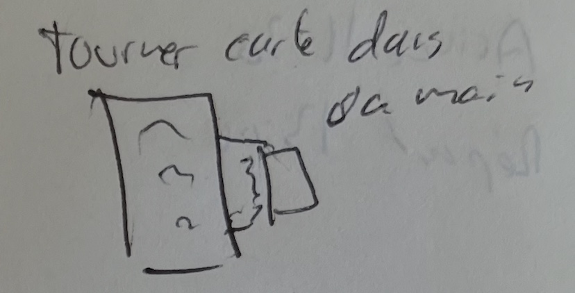

# Jonction toy library

## Setup

Visit, observation, immersion, and encounter at the Jonction toy library

- Arrival 11:30 AM, departure 1:00 PM. Sunny, 13 °C.
- Phones prohibited → No photos, no recordings
- 20 to 30 families present

## Journal

### First impression

Very family-oriented, lots of people — mostly children and their parents. I’m lucky: I happened to come on the _open day_ for Geneva’s toy libraries. Perfect timing.

I’m welcomed by **Sarah**, one of the four toy librarians on site. She’s dressed as a **cosmonaut**, since she’s hosting one of the two rooms dedicated to role-playing games — today’s theme is _space_. It immediately sets the mood.

I have to take off my shoes. Everyone is in socks. It makes me feel at home. It gives the moment a different _tone_, a warmer one. It makes me want to stay a bit longer. I settle in and slowly start to feel like part of the place.

💡 I wonder if keeping my shoes on would have emphasized the feeling of being just passing through, in transition. There’s something interesting to explore in the simple act of taking off one’s shoes. #shoes

### Owner's tour

The place is buzzing with children, which makes it a bit noisy — but not in an unpleasant way. No crying, no piercing screams, just kids expressing joy through play (and sometimes a bit of frustration, too).

Sarah gives me a tour of the place and explains how the different areas and games are organized. Very quickly, I bring up the topic of **cheating**, and ask her what place _“cheating”_ — in a broad sense — has within the institution.

She immediately mentions **preteens**. With that age group, she says, she often pulls out games where cheating is _part of the game_ — sometimes even a condition for participation or victory — such as _Mytho_ or _Werewolf_, where players have to lie about being the werewolf. #cheating #teenager

There are around 20 to 30 families present, mostly with children aged **4 to 12**.
The space is quite large, and I’d say it could easily accommodate another 20 families.  

There are few preteens — maybe 3 or 4. Two hang around without really engaging, while two others are playing at the **only video game console** in the room: a Nintendo Switch. #teenager

Sarah explains that they’ve **intentionally left only a small space for video games**. For example, it’s not possible to borrow them. #video-game

Finally, she tells me that they decided to **move away from age-based labels** for the games, and instead use a **5-star rating system** to indicate the game’s **complexity level**: ⭐️⭐️⭐️⭐️⭐️

💡 The absence of video games might _correlate_ with the absence of preteens. #video-game #teenager

💡 I wonder if **cheating** could be an effective entry point for children aged 6–10? #cheating #children

### Map of space

### Sitting and observe

Tour of the place done. I sit down at one of the gaming tables, take notes, and observe.

There are **seven tables** available to the public, including two child-sized ones. On about half of them, games are already set up — lowering barriers to participation and making it easier to discover new games. #rule

This week’s theme: **retro games**.
  
I notice:

- _Monopoly_, _Mille Bornes_, _Master Mind_, _Ploum_ and _Dix de chute_
- A collective puzzle, half completed. No one is playing with it.

Among these games, only _Mille Bornes_ is a **pure card game**.

Two others include cards as part of the game, but they’re not the central element.

Out of all the games, **three tables are occupied**, including one led by **Arnaud**, the second toy librarian I meet later.

I listen in: Arnaud is explaining the rules of the game — but first, he contextualizes it and tells the story behind it, the _“dream”_ and _“magic”_ the game conveys. Unfortunately, I don’t remember his exact words.

It’s funny: 100% of the kids sitting at the tables are **kneeling on their chairs**, whether they’re sitting on child-sized or adult chairs. #sitting

### Unformal interview

Back near Sarah, the space starts to clear out a bit — things calm down. I take the opportunity to ask her a few questions:

1. **How long do families and children usually stay?**
    - It varies depending on whether people come to _borrow_ games or _play_ on site.
2. **What kind of audience comes here?**
    - Mostly families with **young children**. A few preteens, but they’re rare. Few or no young adults up to 25 years old. Then some adults over 25, often _board game enthusiasts_. #age
3. **What do people enjoy the most here — in terms of games, activities, etc.? Why do they come?**
    - She doesn’t answer directly. Instead, she talks about _pleasure_. That’s what people come here to find. #pleasure
    - She also says that play — unlike a library, for example — creates a **shared space and time** for different audiences to meet, without language, cultural, or other barriers. _“Play is almost universal,”_ she says. They try to make the space as inclusive as possible by removing as many entry barriers as they can. #inclusive
4. I ask her about **rules as an entry barrier**.

   - She gives the example of _foosball_ or simple, manual games, where you don’t need to know the rules to take the first action. _The simpler the game, the more inclusive it is!_ But the **object** itself — its **form** — plays an important role too. #rule #inclusive
   - She explains that they often do a **practice round** first. It’s a good way to onboard players and get around the rule barrier. But it’s probably harder to do with a **card game**. #onboarding
   - 💡 I wonder if **cards — by their very nature — prevent players from learning by doing**, unlike other objects whose _form more easily suggests a function_. I’ll keep this in mind. Worth digging deeper.
  
5. **Why are we barefoot / in socks?**
    - It’s not to make people feel more at home, but to **protect children** — especially those crawling or playing on the floor — from small stones or sharp objects brought in from outside. #shoes

Unfortunately, I didn’t take any notes while asking her these questions.
I preferred to be _present in the moment_ with her.
The conversation turned into a natural exchange, one I can’t fully recall or transcribe in detail.

### Meeting with Arnaud

Sarah then introduces me to **Arnaud**, who seems to know more about games that specifically involve playing cards. I ask him what he thinks about the **role of playing cards** in board games in general.  I’m trying to find out whether there’s some kind of **common denominator** — to understand the **purpose** a card serves within a game. #board-game #mechanics

He lists several points:

- **Randomness**
- **Easy to produce**, inexpensive, just printed
- **Freedom of expression** — more flexibility than a pawn or token
- **Symbols on the cards** make it possible to overcome **language barriers**

Very quickly, he suggests **unpacking a few games** to look at how they’re made.
On the way, he gives me a few references: _Alice in Wonderland_, **Yu-Gi-Oh!** (as a collectible card game), and talks about **Dominion** — a type of game called [[deck-building]]. He also mentions the classic **“Seven Families”** card game as another reference. #deck-building #collection

He also mentions **Bridge** as possibly **the most complex card game in the world** — using traditional playing cards. Along the way, he brings up **7 Wonders** and **Citadels**, highlighting them as examples of interesting **mechanics and gestures** to explore — since in these games, cards are **passed from hand to hand**, from one player to another. #gesture #mechanics

Finally, he talks about [[factory-sealed]] as an interesting **psychological mechanic** to explore — the idea of _not knowing what’s inside the pack_, like with a [[booster-pack]]. That element of **surprise** is compelling. #sealed #booster

He also explains that some games have all their cards **protected in [[sleeve]]** to preserve their quality and **maintain their value**. #protection #sleeve

This mechanic, he says, is **unique to cards**, because **pawns or other physical objects don’t have a hidden side** — they’re **revealed instantly** when the box is opened. They’re transparent, simple to understand… but maybe **they reveal themselves too quickly**? #surprise

💡 It’s interesting to notice how **important a role plastic plays** in the world of playing cards.

According to him, the **main role of a card** in a game is to **move the game forward** — to give it **direction**, to indicate **an action to take**… In a way, it’s a bit like a **map**.

### Unboxing game

We start with Munchkin Quest — a **card game turned into a board game**. Along the way, I pick up some terminology: _tile_ (the cardboard pieces that make up the board), _pawns_, _cards_, _figurines_, … #terminology

I notice that there are **several different card backs**. The back of the card also serves as a **categorization system** — allowing for the creation of **different types of decks**, each with distinct actions and roles. #card-back #deck

💡 I also notice inside the box an **inventory sheet**, which provides clues about how the pieces are **named and grouped**. I don’t discover any new terms here, but it gives me the idea to explore other games in search of new **pieces or terminology**. Something to dig into.

Still on the topic of cards — and transitioning to the next game — he shows me a **new game gesture**.

#### Activate a card

The principle is to **rotate a card 90°**, either in your hand or on the board, to indicate that it’s been **activated**. Here, the sketch shows a **rotational movement** using the **thumb and index finger of the same hand**. #gesture

Next up is **Palm Laboratory** — a **solo game** that relies 100% on the **mechanic of card rotation**.  Each card has **four faces** (two on each side). There’s **no hidden side**, since there’s no opponent — no one to hide information from. This game is an **evolution of Palm Island**. #solitaire

### Before leaving

Before I leave, Arnaud recommends that I visit the **Eaux-Vives toy library** and ask for **Cédric** (mentioning that I’m coming on his behalf).

Cédric, he says, is an expert in **games** — especially **card games**.

He also tells me about [**Joca**](https://www.joca.ch), an association that organizes the **“Night of Games”** and holds regular events at the [**Eaux-Vives Toy Library**](https://www.geneve.ch/ludotheque-eaux-vives).

### Important & Interesting

- They organize a **game night once a month**, on a Friday (no set date yet).
- Go see **Cédric** at the **Eaux-Vives Toy Library**.
